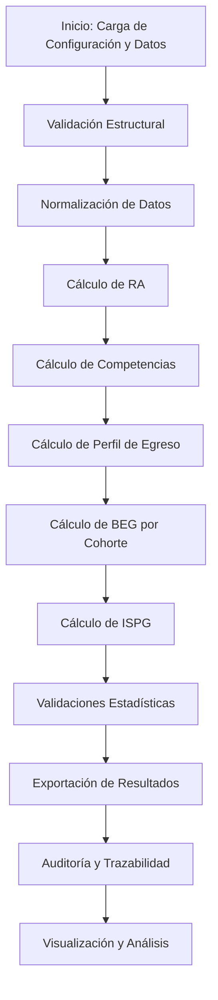

# Checklist de Validación SSD

Al ejecutar el pipeline SSD, verifica los siguientes puntos para asegurar la calidad y completitud de los resultados:

- [ ] **DATOS COMPLETOS:** 156 estudiantes, 2,696 logros, 9 períodos
- [ ] **INTEGRIDAD:** Todas las claves foráneas (FKs) válidas, sin datos huérfanos
- [ ] **RANGO:** Todos los valores normalizados en [0,1]
- [ ] **CONVERGENCIA:** Pipeline ejecuta en ~500ms
- [ ] **RESULTADO:** ISPG entre [0,1], clasificación válida (Rojo/Amarillo/Verde)
- [ ] **OUTPUT:** Archivos generados correctamente, sin errores

---

# SSD Curricular

Sistema de Soporte a la Decisión curricular para aseguramiento de calidad académica.

## Estructura
- Modular, auditable y extensible.
- Configuración y datos en archivos csv/yaml.

## Ejecución
1. Subir archivos de datos y configuración.
2. Ejecutar `python main.py --carrera_id=...`.
3. Outputs y auditoría en carpetas export/audit.

## Pruebas
- Ejecutar pruebas unitarias en `ssd_core/tests` con `python -m unittest discover tests`.

## Documentación
- Ver `Diseño_Conceptual.md` para el modelo y metodología.
- Ver `docs/README.md` para el índice central de la documentación.

## Repositorio
- Recomendado como repositorio privado en GitHub.

# Marco Conceptual y Metodológico

## Fundamentos del Sistema de Soporte a la Decisión Curricular (SSD)

El SSD Curricular es una plataforma diseñada para el aseguramiento de la calidad académica en instituciones de educación superior, integrando principios de ingeniería de sistemas, gestión de calidad, y analítica educativa. Su propósito es proporcionar una visión integral, trazable y auditable del desempeño académico, facilitando la toma de decisiones informada para la mejora continua y la acreditación de programas.

### 1. Principios Teóricos y Normativos
- **Aseguramiento de la calidad:** Basado en modelos internacionales (como ABET, EUR-ACE, CNA-Chile), el SSD promueve la mejora continua, la evidencia objetiva y la trazabilidad de resultados.
- **Modelo jerárquico de evaluación:** El sistema estructura los datos y resultados en una jerarquía: Resultados de Aprendizaje (RA) → Competencias → Perfil de Egreso → Indicadores Sintéticos (BEG, ISPG).
- **No compensatoriedad:** Inspirado en la teoría de sistemas críticos y modelos de mínimos, el SSD no permite que fortalezas en un área compensen debilidades en otra; el desempeño global depende del eslabón más débil.
- **Gestión de riesgos:** Integra riesgos internos (académicos) y externos (empleabilidad, contexto sectorial) para una visión holística del programa.
- **Trazabilidad y auditoría:** Cada indicador y resultado puede rastrearse hasta su fuente de datos y configuración, garantizando transparencia y reproducibilidad.

### 2. Metodología de Evaluación y Cálculo
- **Datos internos:** Incluyen logros académicos por RA, competencias y perfil de egreso, extraídos de sistemas académicos y registros institucionales.
- **Datos externos:** Consideran empleabilidad, satisfacción de empleadores, proyecciones sectoriales y contexto socioeconómico.
- **Normalización y validación:** Todos los indicadores se normalizan (escala 0-1) y se validan mediante controles de integridad, consistencia y pruebas estadísticas (Alpha de Cronbach, simulaciones Monte Carlo).
- **Cálculo jerárquico:**
    - RA: Medición directa del logro de cada resultado de aprendizaje.
    - Competencia: Agregación ponderada de RAs asociados.
    - Perfil de Egreso: Síntesis ponderada de competencias.
    - BEG: Brecha entre el perfil real y el nivel esperado (meta ideal) por cohorte de egresados.
    - ISPG: Indicador sintético que integra BEG, riesgos internos y externos, clasificando el estado del programa.
- **Auditoría y reproducibilidad:** Cada ejecución del sistema genera un registro de configuración, datos, versión y resultados, permitiendo auditoría y comparación longitudinal.

### 3. Referentes Científicos y Buenas Prácticas
- **Literatura:** El SSD se fundamenta en literatura sobre aseguramiento de calidad, evaluación de resultados de aprendizaje, y gestión de riesgos en educación superior (ver sección de referencias).
- **Estándares:** Compatible con marcos internacionales de acreditación y mejora continua.
- **Flexibilidad:** El diseño modular permite adaptar reglas, pesos y estructuras a distintos contextos institucionales y carreras.

### 4. Valor Agregado
- **Visión sistémica:** Permite identificar debilidades estructurales y oportunidades de mejora a nivel de RA, competencia, cohorte y programa.
- **Soporte a la toma de decisiones:** Provee información objetiva y accionable para directivos, comités de calidad, docentes y estudiantes.
- **Base para investigación:** La trazabilidad y riqueza de datos facilitan estudios científicos sobre desempeño, progresión y eficacia curricular.

---

# Lógica de Cálculos e Indicadores

## 1. Jerarquía de Indicadores y Propósito
El SSD Curricular implementa una jerarquía de indicadores que permite evaluar el desempeño académico desde el nivel más granular (Resultado de Aprendizaje, RA) hasta un indicador sintético global (ISPG) para cada cohorte y programa. Cada nivel de la jerarquía tiene una lógica de cálculo rigurosa, basada en principios de evaluación educativa y gestión de calidad.

### Esquema Jerárquico:
- **RA (Resultado de Aprendizaje) → Competencia → Perfil de Egreso → BEG (Brecha Estructural de Egreso) → ISPG (Indicador Sintético del Programa General)**

## 2. Definición y Cálculo de Indicadores

### 2.1. Resultado de Aprendizaje (RA)
- **Definición:** Habilidad o conocimiento específico que el estudiante debe demostrar.
- **Cálculo:**
    - Para cada estudiante y RA, se registra la nota final o nivel de logro (normalizado a 0-1).
    - Si un RA se evalúa en varias asignaturas, se toma el valor más reciente o el promedio, según la política institucional.
- **Ejemplo:**
    - RA1: "Analizar problemas matemáticos complejos". Si un estudiante obtiene 8/10, el valor normalizado es 0.8.

### 2.2. Competencia
- **Definición:** Conjunto de RAs relacionados que representan una capacidad de nivel superior.
- **Cálculo:**
    - Para cada competencia, se identifican los RAs asociados y sus pesos (PESO_RA_EN_COMPETENCIA).
    - Se calcula como suma ponderada de los logros en cada RA:
      
      $$
      \text{Competencia}_i = \sum_{j=1}^{n} (\text{PESO}_{RA_j} \times \text{Logro}_{RA_j})
      $$
    - Los pesos deben sumar 1.0 para cada competencia.
- **Ejemplo:**
    - Competencia C01: "Pensamiento Crítico" = 0.5 × RA1 + 0.5 × RA2

### 2.3. Perfil de Egreso
- **Definición:** Síntesis de todas las competencias que definen al profesional egresado.
- **Cálculo:**
    - Para cada estudiante, se calcula el perfil como suma ponderada de competencias:
      
      $$
      \text{Perfil}_{\text{egreso}} = \sum_{k=1}^{m} (\text{PESO}_{COMP_k} \times \text{Valor}_{COMP_k})
      $$
    - Los pesos de competencias deben sumar 1.0.
- **Ejemplo:**
    - Perfil = 0.6 × C01 + 0.4 × C02

### 2.4. Brecha Estructural de Egreso (BEG)
- **Definición:** Diferencia entre el nivel esperado (meta ideal) y el valor real del perfil de egreso promedio de los egresados de cada cohorte.
- **Cálculo:**
    - Para cada cohorte:
      
      $$
      \text{BEG}_{\text{cohorte}} = \max(0, \text{nivel\_esperado} - \text{Perfil\_Promedio\_Cohorte})
      $$
    - Si el perfil promedio supera la meta, la brecha es 0 (no hay déficit).
- **Ejemplo:**
    - Si nivel_esperado = 0.8 y Perfil_Promedio_Cohorte = 0.75, entonces BEG = 0.05

### 2.5. Riesgo Interno
- **Definición:** Indicador de riesgo académico basado en desempeño, repitencia y deserción.
- **Cálculo:**
    - Para cada cohorte, se calcula el promedio de los indicadores internos de los egresados:
      
      $$
      \text{Riesgo\_Interno}_{\text{cohorte}} = 1 - \text{Promedio\_Desempeño}
      $$
    - Se pueden agregar componentes adicionales según la política institucional.
- **Ejemplo:**
    - Si el promedio de desempeño es 0.85, Riesgo_Interno = 0.15

### 2.6. Riesgo Externo
- **Definición:** Indicador de riesgo basado en contexto laboral, empleabilidad y satisfacción de empleadores.
- **Cálculo:**
    - Para cada cohorte, se calcula:
      
      $$
      \text{Riesgo\_Externo}_{\text{cohorte}} = 1 - \frac{\text{Empleabilidad} + \text{Satisfacción}}{2}
      $$
- **Ejemplo:**
    - Si empleabilidad = 0.76 y satisfacción = 0.80, Riesgo_Externo = 0.22

### 2.7. Indicador Sintético del Programa General (ISPG)
- **Definición:** Síntesis única que integra BEG, riesgo interno y riesgo externo para cada cohorte.
- **Cálculo:**
    
    $$
    \text{ISPG}_{\text{cohorte}} = 0.50 \times \text{BEG} - 0.30 \times \text{Riesgo\_Interno} - 0.20 \times \text{Riesgo\_Externo}
    $$
- **Clasificación:**
    - 🟢 Verde: ISPG ≥ 0.75 (Excelente)
    - 🟡 Amarillo: 0.60 ≤ ISPG < 0.75 (Satisfactorio)
    - 🔴 Rojo: ISPG < 0.60 (Requiere Mejora)

- **Ejemplo:**
    - BEG = 0.05, Riesgo_Interno = 0.15, Riesgo_Externo = 0.22
    - ISPG = 0.50 × 0.05 - 0.30 × 0.15 - 0.20 × 0.22 = 0.025 - 0.045 - 0.044 = -0.064 (Rojo)

## 3. Justificación Científica y Buenas Prácticas
- **No compensatoriedad:** El uso de mínimos y sumas ponderadas evita que fortalezas oculten debilidades críticas.
- **Normalización:** Todos los valores se llevan a escala 0-1 para comparabilidad y robustez estadística.
- **Trazabilidad:** Cada indicador puede rastrearse hasta su fuente de datos y configuración.
- **Validación:** Se aplican controles de integridad, consistencia y validaciones estadísticas para asegurar la calidad de los resultados.

## 4. Ejemplo de Flujo de Cálculo (Cohorte)
1. Se identifican los egresados de la cohorte (nivel máximo alcanzado).
2. Se calcula el perfil promedio de egreso de la cohorte.
3. Se obtiene el nivel esperado (meta ideal) desde la configuración.
4. Se calcula la BEG para la cohorte.
5. Se calculan los riesgos internos y externos.
6. Se integra todo en el ISPG y se clasifica el resultado.

---

# Arquitectura y Estructura del Sistema

## 1. Visión General
El SSD Curricular está diseñado bajo una arquitectura modular y extensible, que separa claramente la lógica de negocio, la configuración, los datos y la exportación de resultados. Esto facilita la mantenibilidad, la auditoría y la adaptación a distintos contextos institucionales.

## 2. Estructura de Carpetas y Archivos

```
SSD_CGV_V2/
│   README.md
│   requirements.txt
│   ...
├── ssd_core/
│   ├── main.py                # Orquestador principal del flujo de cálculo
│   ├── base/                  # Utilidades de carga, validación y auditoría
│   ├── engines/               # Motores de cálculo (RA, competencias, perfil, riesgos, BEG, ISPG)
│   ├── validation/            # Validaciones estadísticas y de integridad
│   ├── export/                # Exportación de resultados y reportes
│   ├── simulation/            # Generación y pruebas con datos simulados
│   └── config/                # Configuración y mapeos (csv/yaml)
├── export/                    # Resultados generados por el sistema
├── audit/                     # Registros de auditoría y trazabilidad
├── docs/                      # Documentación extendida y anexos
└── ...
```

### Descripción de Componentes Clave
- **main.py:** Controla el flujo de ejecución, orquesta la carga de datos, el cálculo de indicadores y la exportación.
- **base/**: Incluye utilidades para cargar archivos, validar estructuras, y registrar auditoría de cada ejecución.
- **engines/**: Contiene los motores de cálculo para cada nivel de la jerarquía curricular y de riesgos (RA, competencias, perfil, BEG, ISPG, riesgos internos/externos).
- **validation/**: Implementa validaciones estadísticas (Alpha de Cronbach, Monte Carlo, sensibilidad) y controles de integridad.
- **export/**: Gestiona la exportación de resultados en formatos compatibles con Power BI y otros sistemas.
- **simulation/**: Permite la generación de datos sintéticos y pruebas de robustez.
- **config/**: Archivos de configuración, mapeos y pesos (csv/yaml).
- **export/** (raíz): Carpeta donde se almacenan los resultados y reportes generados.
- **audit/**: Guarda los registros de auditoría, asegurando la trazabilidad y reproducibilidad.
- **docs/**: Documentación extendida, manuales y anexos. Ver `docs/README.md` para acceder a toda la documentación central.

## 3. Flujograma del Sistema (Texto)

1. **Carga de Configuración y Datos:**
    - Se leen archivos de configuración (model_config.yaml, csv de mapeos) y datos académicos.
2. **Validación Estructural:**
    - Se verifica la integridad, consistencia y cobertura de los datos.
3. **Normalización:**
    - Todos los valores se normalizan a escala 0-1.
4. **Cálculo Jerárquico:**
    - RA → Competencia → Perfil de Egreso → BEG (por cohorte) → ISPG (integrando riesgos).
5. **Validaciones Estadísticas:**
    - Se aplican pruebas como Alpha de Cronbach y simulaciones Monte Carlo.
6. **Exportación y Auditoría:**
    - Se generan archivos de resultados y registros de auditoría para trazabilidad total.
7. **Visualización y Análisis:**
    - Los resultados pueden ser analizados en Power BI, reportes institucionales o benchmarking externo.

## 4. Diagrama de Flujo (Mermaid)



---

# Glosario SSD Curricular

## Glosario de Términos Generales

**Acreditación:** Proceso formal de evaluación y certificación de la calidad de un programa académico por parte de una agencia externa.

**Auditoría:** Proceso de registro automático de cada ejecución del sistema, incluyendo hash de archivos, versión de modelo, parámetros y resultados, para asegurar trazabilidad y reproducibilidad.

**Cohorte:** Grupo de estudiantes que ingresan o egresan en un mismo periodo académico. En los archivos de exportación, se identifica con la columna `ID_Cohorte`.

**Configuración (config):** Archivos (csv/yaml) que definen reglas, pesos, mapeos, parámetros de normalización, nivel máximo de egreso y nivel esperado.

**Meta Ideal (Nivel Esperado):** Valor objetivo (por ejemplo, 0.8) que representa el estándar de calidad que se espera alcanzar en el perfil de egreso de cada cohorte.

**No compensatoriedad:** Principio según el cual una debilidad en un área (RA, competencia) no puede ser compensada por fortalezas en otras; el desempeño global depende del eslabón más débil.

**Simulación:** Generación de datos sintéticos para pruebas, validación y robustez del sistema.

**Trazabilidad:** Capacidad de rastrear cada resultado o indicador hasta su fuente de datos, configuración, fecha de generación y parámetros utilizados. Se implementa mediante columnas como `Fuente_datos`, `Fecha_generacion_indicador`, `run_id`, etc.

**Validación:** Proceso de verificación de integridad, consistencia y robustez de los datos y resultados, incluyendo controles estadísticos y estructurales.

**run_id:** Identificador único de la ejecución del sistema, utilizado para auditoría y trazabilidad total.

---

## Glosario de Indicadores

**Alpha de Cronbach:** Estadístico que mide la consistencia interna de un conjunto de ítems o indicadores, utilizado para validar la fiabilidad de los resultados agregados (por ejemplo, logros de RA).

**BEG (Brecha Estructural de Egreso):** Diferencia entre el nivel esperado (meta ideal) y el perfil promedio real de egreso de una cohorte de estudiantes egresados.

**Desempeño:** Indicador numérico (normalizado 0-1) que representa el promedio de notas o logros académicos de un estudiante o cohorte.

**Deserción:** Proporción de estudiantes que abandonan el programa antes de egresar. Se calcula como el número de estudiantes que no completan el nivel máximo dividido por el total de la cohorte.

**Empleabilidad:** Proporción de egresados que logran insertarse en el mercado laboral en un periodo determinado. Columna clave en riesgo externo.

**ISPG (Indicador Sintético del Programa General):** Indicador global que integra BEG, riesgos internos y externos, clasificando el estado del programa en Verde, Amarillo o Rojo.

**Perfil de Egreso:** Síntesis de competencias que define al profesional egresado, alineado con estándares y expectativas del sector. Se calcula como suma ponderada de competencias.

**Perfil_Promedio_Cohorte:** Valor promedio del perfil de egreso alcanzado por un estudiante individual.

**RA (Resultado de Aprendizaje):** Habilidad, conocimiento o actitud específica que el estudiante debe demostrar al finalizar una asignatura o módulo. Identificado por columnas como `RA`, `ID_RA`.

**Repitencia:** Número de veces que un estudiante debe cursar una asignatura para aprobarla. Indicador de riesgo interno.

**Riesgo Externo:** Indicador de contexto laboral y sectorial, calculado a partir de empleabilidad, satisfacción de empleadores y proyecciones del sector. Columna `riesgo_externo`.

**Riesgo Interno:** Indicador de riesgo académico, calculado a partir de desempeño, repitencia y deserción. Columna `riesgo_interno`.

**Satisfacción:** Valoración de empleadores sobre la calidad de los egresados. Columna clave en riesgo externo.

---

## Glosario de Variables y Columnas de Exportación

**Abandono:** Variable binaria o numérica que indica si un estudiante ha abandonado el programa. Se utiliza para calcular la deserción.

**BEG:** Columna en beg_cohorte.csv que representa la brecha estructural de egreso para cada cohorte.

**desempeño:** Columna en riesgos_internos_individual.csv que representa el promedio de notas o logros académicos de un estudiante.

**deserción:** Columna en riesgos_internos_individual.csv y archivos de resumen de cohorte, que indica la proporción de estudiantes que abandonan.

**Empleabilidad:** Columna en riesgos_externos.csv que indica la proporción de egresados empleados.

**Fecha_corte:** Fecha en la que se realiza el análisis o cierre de datos para una cohorte o periodo.

**Fecha_generacion_indicador:** Timestamp que indica cuándo se generó un indicador o archivo de exportación, útil para trazabilidad.

**Fuente_datos:** Campo que especifica el archivo o fuente original de los datos utilizados para calcular un indicador.

**ID_Cohorte:** Identificador único de la cohorte (por ejemplo, "O2010-1").

**ID_EST:** Identificador único de estudiante.

**ID_PERFIL:** Identificador del perfil de egreso asociado a un estudiante o cohorte.

**Nivel:** Grado académico alcanzado por el estudiante (por ejemplo, PRIMER, NOVENO). El nivel máximo define egreso.

**Nivel_maximo:** Valor parametrizable en config que define el nivel necesario para considerar a un estudiante como egresado.

**Periodo:** Intervalo académico (por ejemplo, semestre) en el que se agrupan estudiantes o se realiza el análisis. Columna clave en exportaciones.

**PERFIL_Promedio:** Valor promedio del perfil de egreso alcanzado por un estudiante individual.

**Perfil_Promedio_Cohorte:** Valor promedio del perfil de egreso de todos los egresados de una cohorte.

**RA:** Identificador de resultado de aprendizaje, columna clave en logros individuales y matrices.

**Repitencia:** Columna que indica el número de veces que un estudiante cursó una asignatura.

**riesgo_externo:** Columna calculada a partir de empleabilidad y satisfacción, representa el riesgo externo de la cohorte.

**riesgo_interno:** Columna calculada a partir de desempeño, repitencia y deserción, representa el riesgo interno de la cohorte.

**run_id:** Identificador único de la ejecución del sistema, utilizado para auditoría y trazabilidad total.

**Satisfacción:** Columna en riesgos_externos.csv que indica la valoración de empleadores.

---
